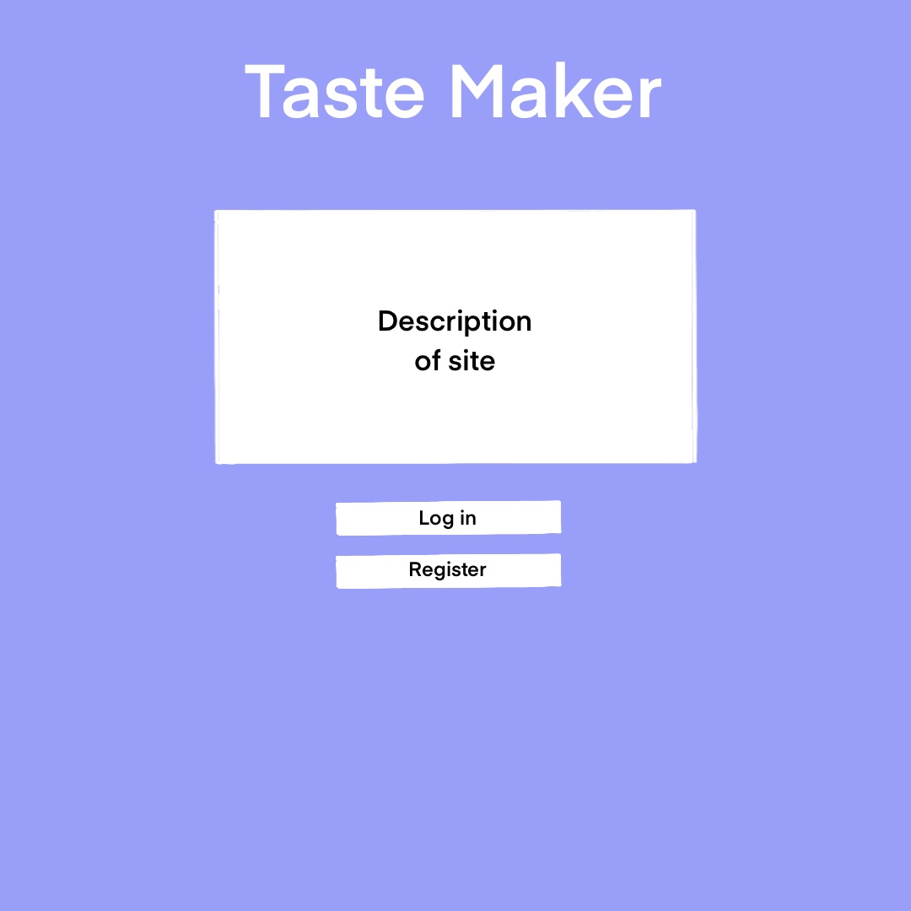
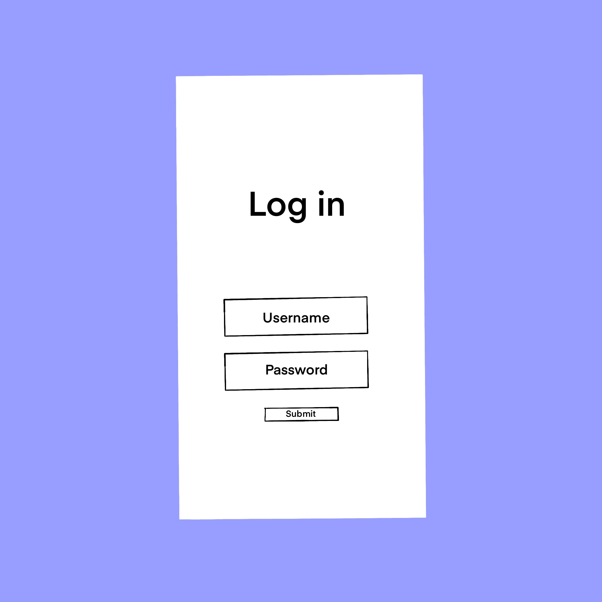
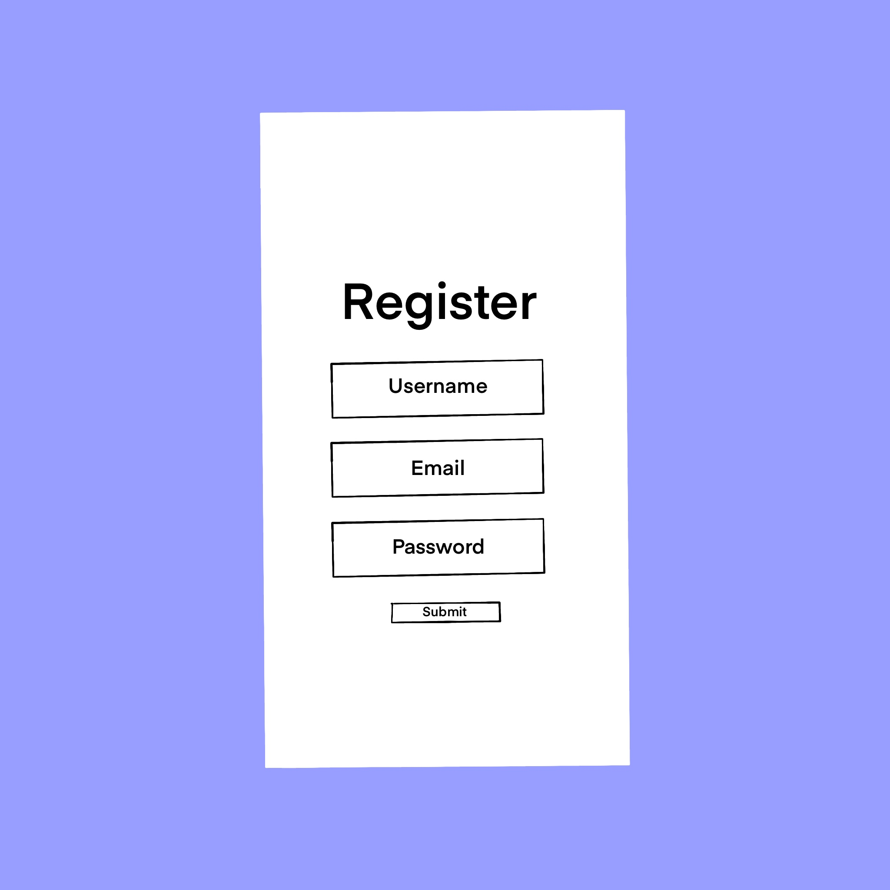
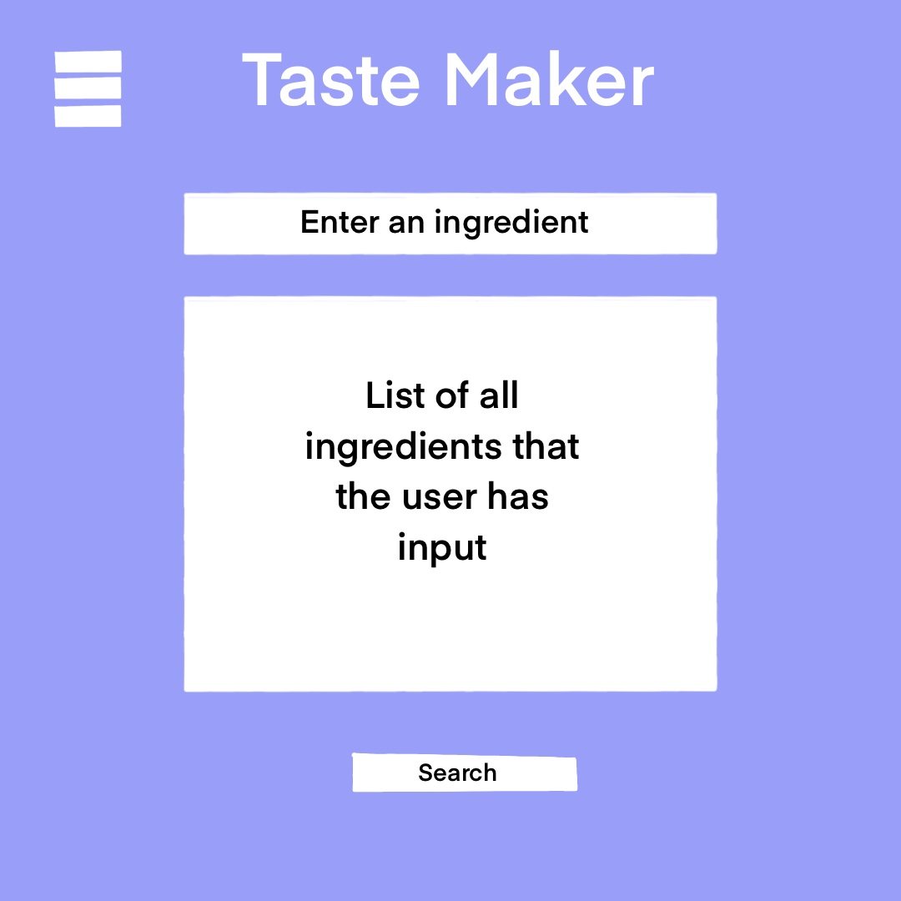
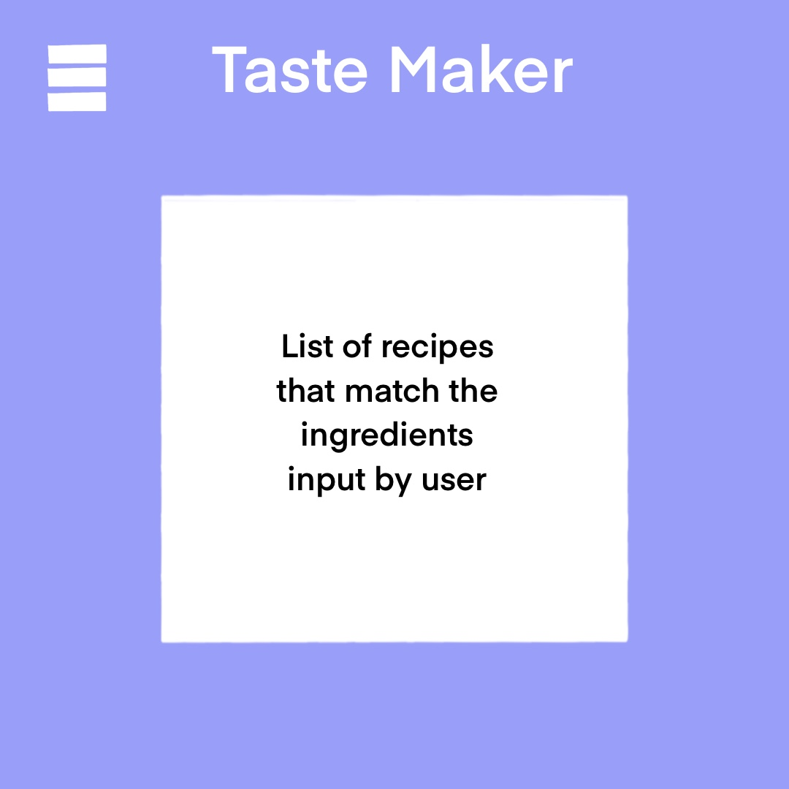
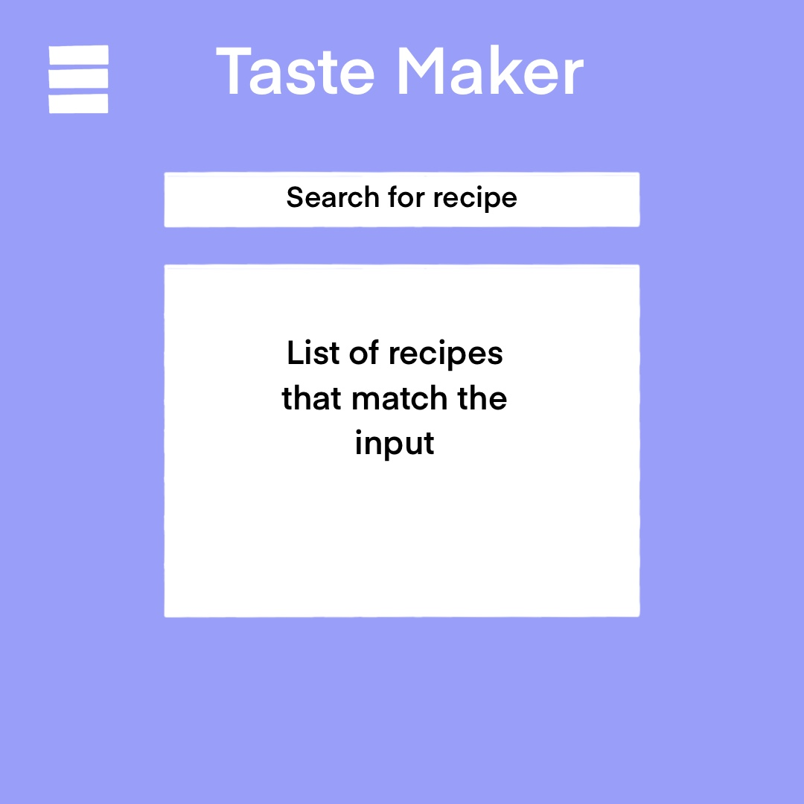
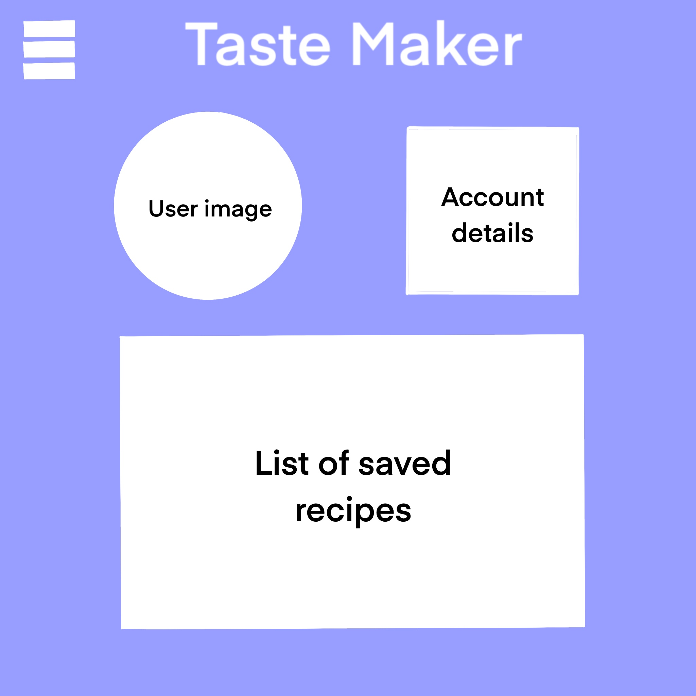
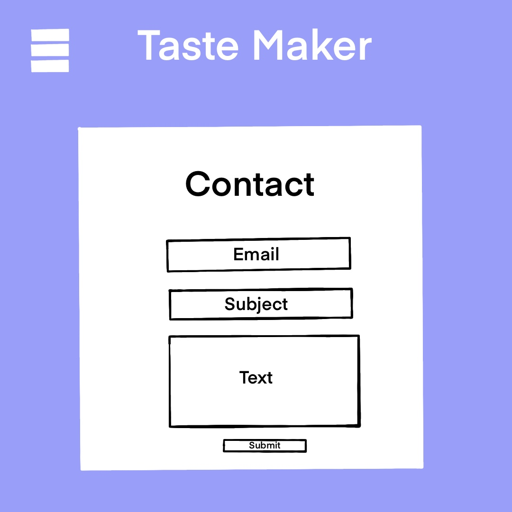
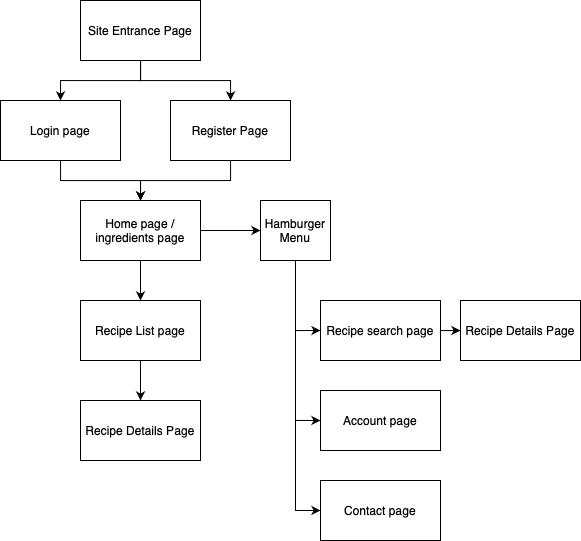

# Taste Maker

## Overview
With this app a user will be able to enter in combinations of ingredients they may have and recieve a list of recipes that they are able to make. They will also be able to search for certain recipes based on name and recieve details on cooking instructions and ingredients required.

## Data Model
The application will store Users and List of Favorite Recipes

* each user will have a list of ingredients and top recipes
* each list of top recipes will store names/ids of recipes

An Example User:
```javascript
{
    username: 'foodlover123',
    name: 'Charles',
    hash: // a password hash
}
```
An Example List of Top Recipes:
```javascript
{
    user: // a reference to a User object
    recipes: ['curry', 'chocolate cake', 'chicken fried steak']
}
```

## [Link to Schema](./src/db.js)

## Wireframes
/entrance - first page user sees when entering site

/login - first page user sees when entering site

/register - first page user sees when entering site

/home - first page user sees when entering site

/results - first page user sees when entering site

/search - first page user sees when entering site

/account - first page user sees when entering site

/contact - first page user sees when entering site


## Site Map


## User Stories or Use Cases
1. As a non-registered user, I can register using my email
2. As a user, I can log in to the site using my unique credentials (username and password)
3. As a user, I want to enter any ingredient I have to be saved
4. As a user, I can get a list of recipes that correspond to the ingredients on my account
5. As a user, I want to be able to search for recipes using a keyword or by exact name

## Research Topics
* (2 Points) Use a CSS Framework throughout site
    * I will be using tailwind.css for all stying needs
* (5 Points) Passport.js
    * Passport.js will be used to handle user creation
* (2 Points) External API
    * The app will revolve around key features in the MealDB API so I will be learning how it functions

9 points total out of 8 required

## [Link to Initial Main Project File](./src/App.js)

## References Used
1. [tailwind.css docs](https://tailwindcss.com/docs)
2. [passport.js docs](http://www.passportjs.org/docs/)
3. [MealDB API docs](https://www.themealdb.com/api.php)
